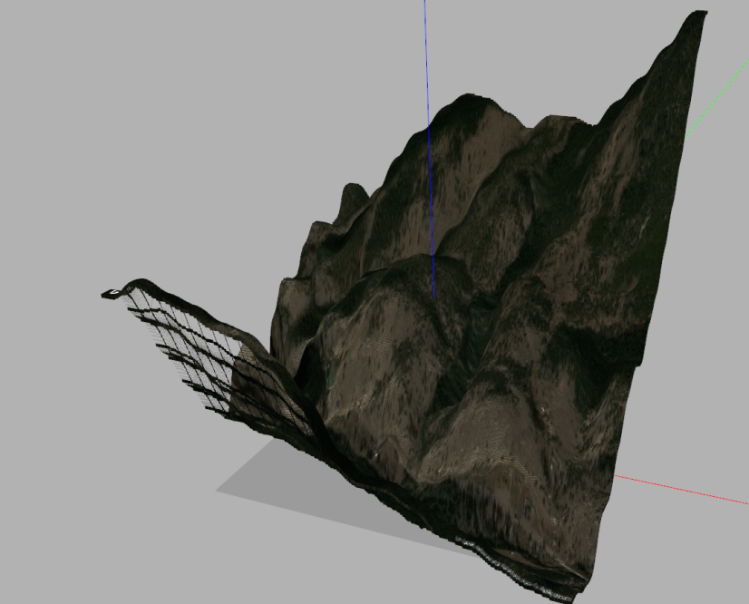

# Gazebo Terrain Generator Website 



The website allows you to position of a bounding box over an aerial map view of a location on earth. Upon clicking generate, the site will contact bing maps, ask for an aerial view of the selected area as well as an array of the elevation of the area. This is then used to generate a gazebo model using a heightmap. The website automatically scales the model to the correct units to be used in your simulation.

## Dependencies 
This project utalizes a flask backend. the dependencies for the server can be installed by running the following.
```
pip3 install --upgrade pip
pip3 install -r requirements.txt
```

To begin the application website, run app.py

Test scripts available in test_scripts folder:
1. model_gen.py - populates the Colorado model template in the templates folder in the root directory
2. terrain.py - generates the model and textures folder within test_scripts directory
